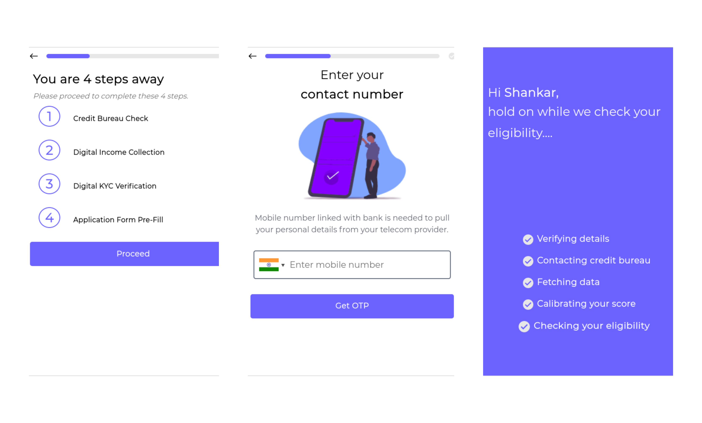

# Flowboard Web SDK

[](https://)

## Table of contents

- [Overview](#overview)
- [Getting started](#getting-started)
- [Handling callbacks](#handling-callbacks)
- [Removing the SDK](#removing-the-sdk)
- [Customizing the SDK](#customizing-the-sdk)
- [User Analytics](#user-analytics)
- [Going live](#going-live)
- [Accessibility](#accessibility)
- [More information](#more-information)

## Overview

This SDK provides a set of components for JavaScript applications to enable enterprises to onboard the users with ease. The SDK offers a number of benefits to help you create the best onboarding / identity verification experience for your customers:

- Carefully designed UI to guide your customers through the entire onboarding process
- Verify user's mobile number from the service provider through our SOTA APIs
- Get user's Income Tax return and assess user.
- Seamlessly establish user's identity using government ID's.
- Get your user KYC done with user's friendly interface

Note: the SDK is only responsible for providing user with simple, easy to use interface to guide through the onboarding process. You still need to access the [Flowboard API]() to manage applicants and checks.

Users will be prompted to verify the phone, IDs and other documents required to establish user identity. This will include OTP based verification at different stages of application.



## Getting started

### 1. Obtaining an API token

Contact our sales team to obtain a sandbox token and test the integration of this SDK with your application.

### 2. Generating an SDK token

For security reasons, instead of using the API token directly in you client-side code, you will need to generate and include a short-lived JSON Web Token ([JWT](https://jwt.io/)) every time you initialize the SDK. To generate an SDK Token you should perform a request to the [SDK Token endpoint](https://sandbox.flowboard.in/api/v1/customer/) in the Flowboard API. Look into the [Flowboard API Documentation](https://docs.flowboard.in) for further Reporting APIs:

```shell
$ curl --location --request POST 'https://sandbox.flowboard.in/api/v1/customer/' \
--header 'Content-Type: application/json' \
--header 'Authorization: Bearer YOUR API TOKEN' \
--data-raw '{
	"hosted": true,
	"scopes": ["customer-consent", "aadhaar-xml-text", "telecom", "itr", "read", "income", "customer-edit"]
}'
```

Make a note of the `token` value in the response, as you will need it later on when initialising the SDK.

\* Token expires in 7 days after creation.

### 3. Including/Importing the library

#### 3.1 HTML Script Tag Include

Include it as a regular script tag on your page:

```html
<script src="https://cdn.jsdelivr.net/gh/FlowboardIN/flowboard-web-sdk@1.0.0/lib/bundle/flowboard.min.js"></script>
```

And the CSS styles:

```html
<link
  rel="stylesheet"
  href="https://cdn.jsdelivr.net/gh/FlowboardIN/flowboard-web-sdk@1.0.0/lib/bundle/flowboard.css"
/>
```

#### Notice

The library is **Browser only**, it does not support the **Node Context**.

### 4. Adding basic HTML markup

There is only one element required in your HTML, an empty element for the modal interface to mount itself on:

```html
<!-- At the bottom of your page, you need an empty element where the
verification component will be mounted. -->
<div id="flowboard-mount"></div>
```

You can just clone this repo and add token to index.js file and then run index.html in a browser

### 5. Initialising the SDK

You are now ready to initialise the SDK:

```javascript
flowBoard.init({
  // the JWT token that you generated earlier on
  token: 'JWT_CUSTOMER_INIT_TOKEN',
  // id of the element you want to mount the component on
  containerId: 'flowboard-mount',
  onComplete: function(data) {},
  onError: function(data) {},
  fetchCreditScore: function(data,callback){},
  steps:[
   { type: "welcome" },
    ]
  }

```

Congratulations! You have successfully started the flow. Carry on reading the next sections to learn how to:

- Handle callbacks
- Remove the SDK from the page
- Customise the SDK
- Create checks

## Handling callbacks

- **`onComplete {Function} optional`**

  Callback that fires when the user sucessfully completes all the steps.
  At this point you can trigger your backend to create a check by making a request to the Flowboard API.

  Here is an `onComplete` callback example:

  ```javascript
  {
      data,
      status_code: 200,
      message: "Onboarding of client successful",
      success: true,
  }
  ```

  Based on the JWT token, you can then create a check for the user via your backend.

- **`onError {Function} optional`**

  Callback that fires when an error occurs. The callback returns the following errors types:

  - `exception`
    This type will be returned for the following errors:

    - Timeout and Server Errors
    - Authorization
    - Invalid token

  - `expired_token`
    This error will be returned when a token is expired. This error type can be used to provide a new token at runtime.

  Here is an example of the data returned by the `onError` callback:

  >Example of data returned for an exception error type:
  ```javascript
  {
    data: {
      error: "INT_SERVER_ERROR",
    },
    status_code: 500,
    message: "Internal server error occurred",
    success: false,
  }
  ```

  >Example of data returned for an expired_token error type:
  ```javascript
  {
    data: {
      error: "UNAUTH_ACCESS",
    },
    status_code: 401,
    message: "Invalid Token ",
    success: false,
  }
  ```

- **`fetchCreditScore {Function} required`**

  This function is called to fetch the users credit score. It is passed with two input parameters. `data` contains user's details (eg. Name, Email, Phone Number) and `callback` function which is required to be called with user's credit score once fetched.

  Note: SDK waits till the credit score is passed to the `callback` function. If users credit score is not found then the callback function should be called with `null` or `0`. Also, `fetchCreditScore` can be called multiple times, with additional data. Please handle accordingly.

  >Example of `fetchCreditScore` function defination:

  ```javascript
  fetchCreditScore(data, callback) {
    //Defined by the SDK User
    const credit_score = await customCreditScorePull(data);
    //..........
  
    //Callback after credit_score pulled successfully
    callback(credit_score);
  }
  ```

## Removing the SDK

If you are embedding the SDK inside a single page app, you can call the `tearDown` function to remove the SDK completely from the current webpage. It will reset state and you can safely re-initialise the SDK inside the same webpage later on.

```javascript
FlowboardOut = Flowboard.init({...})
...
FlowboardOut.tearDown()
```

## Customizing the SDK

A number of options are available to allow you to customise the SDK:

- **`token {String} required`**

  A JWT is required in order to authorise the user each time there is a request made to our API endpoint

  Example:

  ```javascript
  <script>
      function triggerFlowboard() {
        window.Flowboard.init({
          token: 'JWT_CUSTOMER_TOKEN',
          onComplete: function(data) {
            // callback for when everything is complete
            console.log("everything is complete")
          }
        });
      };
  </script>

  <body>
    <!-- Use a button to trigger the flowBoard SDK  -->
    <button onClick="triggerFlowboard()">Verify identity</button>
    <div id='flowboard-mount'></div>
  </body>
  ```

- **`containerId {String} optional`**
  A string of the ID of the container element that the UI will mount to. This needs to be an empty element. The default is `flowboard-mount`.

- **`userDetails {Object} optional`**
  Some user details can be specified ahead of time, these details will be pre-filled.

  The following user details can be used by the SDK:

  - `mobile_number` (string) (optional) : This should be with a country code (e.g. `"+91987654321"`)
  - `full_name` (string) (optional)
  - `email` (string) (optional)
  - `pan_number` (string) (optional)
  - `father_name` (string) (optional)
  - `mother_name` (string) (optional)
  - `aadhaar_number` (string) (optional)
  - `dob` (string) (optional) :  This should be formatted as `YYYY-MM-DD` (eg. `1990-12-11`)
  - `aadhaar_number` (string) (optional)
  - `gender` (string) (optional)
    
   >Example:
  ```javascript
  userDetails: {
      mobile_number: '+911234567890',
      full_name : "John Doe",
      email : "johndoe@example.com",
      pan_number : "ABCDE1234F",
      father_name : "Lorem Ipsum",
      mother_name : "Sit Dor",
      aadhaar_number : "123456789123",
      gender : "M"
  }
  ```

- **`eligibilityConfigs {Object} required`**
  Eligibility parameters like credit score `thresholdScore` can be provided so that it can be determined when the user is `inEligibleScore` or `noCreditScore` step as described below.

  ```javascript
    eligibilityConfigs: {
        eligibleCreditScore : 700
    }
  ```

- **`enterpriseFeatures {Object} optional`**
  If your account has enterprise features enabled and you are using an SDK token, you can add the desired features to an enterpriseFeatures object inside the options object. The enterprise features currently available are listed below.

  #### hideFlowBoardLogo:

  Enabling this feature will remove the FlowBoard logo from all screens.

  ```javascript
  enterpriseFeatures: {
    hideFlowBoardLogo: true;
  }
  ```
  #### cobrand:

  ```javascript
  options: {
    enterpriseFeatures: {
      cobrand: {
        text: "ABCD Company";
      }
    }
  }
  ```
  In the example above, the resulting watermark will be ABCD Company powered by Flowboard where "powered by Flowboard" is not editable. The text provided in your enterprise feature options will always be displayed before the "powered by FlowBoard" text.

  Note that if the `hideFlowBoard` feature is enabled, then no footer text/image is displayed even if `cobrand` has been configured.

- **`language {String || Object} optional`**
  The SDK language can be customized by passing a String or an Object. At the moment, we support and maintain translations for English (default) only. Future languages will be added in future updates. The `language` option should be passed as a string containing a supported language tag.

  >Example:

  ```javascript
  language: "en";
  ```

  The SDK can also be displayed in a custom language by passing an object containing the `locale` tag and the custom `phrases`.
  The object should include the following keys:

  - `locale`: A locale tag. This is **required** when providing phrases for an unsupported language.
    You can also use this to partially customise the strings of a supported language (e.g. English), by passing a supported language locale tag (e.g. `es`). For missing keys, the values will be displayed in the language specified within the locale tag if supported, otherwise they will be displayed in English.

  - `phrases` (required) : An object containing the keys you want to override and the new values. The keys can be found in [`src/locale/en.json`](../src/locales/en.json). They can be passed as a nested object or as a string using the dot notation for nested values. See the examples below.

  ```javascript
  language: {
    locale: 'en',
    phrases: { welcome: { title: 'My custom title' } },
  }
  ```

  If `language` is not present the default copy will be in English.

* **`steps {List} required`**

  List of the different steps and their custom options. Each step can either be specified as a string (when no customisation is required) or an object (when customisation is required):
  >Example steps object:
  ```javascript
  steps: [
    { type: "welcome" },
    { type: "stepsIntro" },
    {
      type: "phoneVerify",
      options: {
        consent: `You agree to  <a href="https://example.com">terms and conditions</a>`,
      },
    },
    {
      type: "telecomInfo",
      options: {
        consent: `These are correct, please go ahead to check my bureau score I allow you to do so`,
      },
    },
    {
      type: "creditScore",
      options: {
        inEligibleScore: [{ type: "complete", options: { status: "decline" } }],
        noCreditScore: [
          { type: "creditScoreAdditionalInfo" },
          { type: "complete", options: { status: "accept" } },
        ],
      },
    },
    { type: "itrIntro" },
    {
      type: "itrPull",
      options: {
        consent: `You agree to  <a href="https://example.com">terms and conditions</a>`,
      },
    },
    { type: "aadhaarIntro" },
    {
      type: "offlineAadhaarPull",
      options: {
        consent: `You agree to  <a href="https://example.com">terms and condition</a>`,
        terms: `You agree to  <a href="https://example.com">terms and condition</a>`,
      },
    },
    {
      type: "applicationForm",
      consent: `You agree to  <a href="https://example.com">terms and condition</a>`,
    },
    { type: "complete", options: { status: "accept" } },
  ];
  ```

  In the example above, the SDK flow is consisted of following steps: `welcome`, `stepsIntro`, `phoneVerify`, `telecomInfo`, `creditScore`, `itrIntro`, `itrPull`, `aadhaarIntro`, `offlineAadhaarPull`, `applicationFormIntro`, `applicationForm` , and `complete`.

  Below are descriptions of the steps and the custom options that you can specify inside the `options` property. Unless overridden, the default option values will be used:

  ### `welcome`

  This is the introduction screen of the SDK. Use this to introduce yourself. You can place your branding information like your name and logo in `brandingConfigs` described in [Customizing the SDK](#customizing-the-sdk). You can choose to skip this step and directly introduce your user to the steps of onboarding described in next section. The custom options are:

  ### `stepsIntro`

  This is where your user will be introduced to the chronological steps to be followed while onboarding the user. The custom options are:
   
    * `steps` (object)
    
        The list of steps you want to describe to the user (sequentially)
    ```javascript
  
    options: {
          steps: [
                {
                title: "Credit Bureau Check",
                description: "Fetching details from phone number.",
                },
                {
                    title: "Digital Income Collection",
                    description: "Estimate income from details",
                },
                {
                    title: "Digital KYC Verification",
                    description: "KYC verification from your Aadhaar",
                },
                {
                    title: "Application Form Pre-Fill",
                    description: "In this, you have to give us more details about you",
                }
          ]
    }
    ```
  ### `phoneVerify`

  Verifies user mobile number with telecom service provider through OTP.  The custom options are:
   
   * `consent` (string) (supports HTML)
      
      Consent for verifying user via telecom provider
    ```javascript
    options: {
      consent: `You agree to  <a href="https://example.com">terms and condition</a>`
    }
  ```
  
  ### `telecomInfo`

  Display details to the user to make correction to details that was pulled from `phoneVerify`. The custom options are:
   
   * `consent` (string) (supports HTML)

    Consent for pulling credit score using the pulled details  can be done  here 
  ```
    options: {
      consent: `These are correct, please go ahead to check my bureau score`,
    },
  ```

  ### `creditScore`

  Invoke `fetchCreditScore` as initiated above and ask additional information if required to do so.
  
  As per the user eligibility (`eligibleCreditScore`) they are navigated to the various sub-steps and if they clear the eligibility critieria they move to next step. Following are the sub-steps:
   
  * `inEligibleScore`:
  
    When the user is not eligible based on credit score and `eligibleCreditScore` then `inEligibleScore` sub-step will be used to determine the next steps.
    
  * `noCreditScore`:
  
    When there is no score available, If `null` or `0` score is returned in callback function (in `fetchCreditScore`) then `NoCreditScore` options will be executed in the order. The below steps can be used here:

     ##### `CreditScoreAdditionalInfo`

    Step to ask user additional information (PAN Number and DOB) to hit credit bureau. In case the user again lands on the `noCreditScore`, they are sent to subsequent steps like `complete` as in the example below.
  
  > Example:
  
  ```javascript
      {
        type: "creditScore",
        options: {
          inEligibleScore: [
              { type: "complete", options: { status: "decline" } }
          ],
          noCreditScore: [
            { type: "creditScoreAdditionalInfo" },
            { type: "complete", options: { status: "decline" } },
          ]
        }
  ```
  ### `ItrIntro`
  Introduction to ITR return fetching and Digital Income Collection.

  ### `itrPull`

  Pulling ITR from Income tax department based on PAN number provided by the user and ITR Password. In case user choose to reset password then user need to enter the OTP sent to their Aadhaar linked mobile. The custom options are:

   * `consent`(string) (supports HTML)
                    
      Consent for pulling ITR using user provided details
                  
  ```javascript
  options: {
    consent: `You agree to  <a href="https://example.com">terms and condition</a>`
  }
  ```
 
  ### `aadhaarIntro`

  Introduction to aadhaar information fetching and Digital KYC. 

  ### `offlineAadhaarPull`

  Pulling aadhaar information digitally from UIDAI via XML. The custom options are:
  
  * `terms` (object)
    
    Terms that you want your user to agree with while fetching the user's aadhaar information from UIDAI.
    
   * `consent` (string) (supports HTML)
   
      Consent for pulling aadhaar using user provided details
  
  ```javascript
    options:{
      terms: `You agree to  <a href="https://example.com">terms and condition</a> and that you authorize us to fetch your information from UIDAI.`,
      consent: `I agree to  <a href="https://example.com">terms and condition</a>`
    }
  ```

  ### `ApplicationFormIntro`

  Introduction to application form for the respective facility.

  ### `ApplicationForm`

  This step is meant for user to fill various details related to personal and employment information.
  The custom options are:

  * `educationOptions` (object)
    
    List of educational qualification as per the SDK user.

  ```javascript
    options:{
      educationOptions:[
        {
          value: "Primary Education",
          text: "Primary Education"
         },
         {
          value: "Secondary Education",
          text: "Secondary Education"
         }
      ]
    }
  ```

  * `maritalStatusOptions` (object)
    
    List of marital status as per the SDK user.

  ```javascript
    options:{
      maritalStatusOptions:[
        {
          value: "Married",
          text: "Married"
        },
        {
          value: "Unmarried",
          text: "Unmarried"
        },
      ]
    }
  ```

  
  * `employmentOptions` (object)

    List of eductaion options as per the SDK user.
    
    ```javascript
    options:{
      employmentOptions:[
        {
          value: "Salaried",
          text: "Salaried"
        },
        {
          value: "Unemployed",
          text: "Unemployed"
        },
      ]
    }
    ```
    
    ### `Complete`
  
    This step completes the onboarding process and the user won't be passed to further steps. `onSuccess` function to is invoked in this step. Here you can tear down the SDK. The custom options are:
    
     * `status` (string): 

        various options are (`decline,accept,waitlist`)
     
     >Example:
      ```javascript
         options:{
            { 
                type: "complete", 
                options: { status: "waitlist" }
            }
         }
      ```

## User Analytics

The SDK allows you to track the user's journey through the onboarding process via a dispatched event. This is meant to give some insight into how your user's make use of the SDK screens.

### Overriding the hook

In order to expose the user's progress through the SDK an `EventListener` must be added that listens for `UserAnalyticsEvent` events. This can be done anywhere within your application and might look something like the following:

```javascript
addEventListener('userAnalyticsEvent', (event) => /*Your code here*/);
```

The code inside of the `EventListener` will now be called when a particular event is triggered, usually when the user reaches a new screen. For a full list of events see the bottom of this section.

The parameter being passed in is an `Event` object, the details related to the user analytics event can be found at the path `event.detail` and are as follows:

- `eventName`: A `String` indicating the type of event. Currently will always this return as `"Screen"` as each tracked event is a user visiting a screen. In the future more event types may become available for tracking.
- `properties`: A `Map` object containing the specific details of an event. This will contain things such as the `name` of the screen visited.

### Using the data

Currently we recommend using the above hook to keep track of how many user's reach each screen in your flow. This can be done by storing the count of users that reach each screen and comparing them to the amount of user's who've made it to the `Welcome` screen.

### Tracked events

Below is the list of potential events currently being tracked by the hook:

```
WELCOME - User reached the "Welcome" screen
STEPS_INTRODUCTION - User reached the "stepsIntro" screen.
PHONE_VERIFICATION - User reached the "Phone verification" screen
TELECOM_INFO - User reached the "telecomInfo" screen. where details fro operator is shown to the user
CREDIT_SCORE - User reached the "creditScore" screen.
INELIGIBLE_SCORE - User reached the "ineligibleScore" screen
CREDIT_SCORE_ADDITIONAL_INFO - User reached the "creditScoreAdditionalInfo" screen
ITR_INTRO - User reached the "itrIntro" screen
ITR_PULL - User reached the "itrPull" screen
AADHAAR_INTRO - User reached the "aadhaarIntro" Screen.
OFFLINE_AADHAAR_PULL - User reached the "offlineAadhaarPull" screen
APPLICATION_FORM_INTRO - User reached the "applicationFormIntro" screen
APPLICATION_FORM - User reached the "applicationForm" screen
COMPLETE - User reached the "complete" screen
```

## Going live

Once you are happy with your integration and are ready to go live, please contact [support@flowboard.in](mailto:support@flowboard.in) to obtain live version of the API token. We will have to replace the sandbox token in your code with the live token.

## Accessibility

The Flowboard SDK has been optimised to provide the following accessibility support by default:

- Keyboard navigation: all interactive elements are reachable using a keyboard
- Sufficient color contrast: default colors have been tested to meet the recommended level of contrast
- Sufficient touch target size: all interactive elements have been designed to meet the recommended touch target size

### Browser compatibility

|  |  |  |  |  |
| --------------------------------------------------------------------------------------------------- | ------------------------------------------------------------------------------------------------------ | --------------------------------------------------------------------------------------------------------------------------------------- | --------------------------------------------------------------------------------------------- | --------------------------------------------------------------------------------------------------- |
| Latest ✔                                                                                            | Latest \* ✔                                                                                            | 11 ✔                                                                                                                                    | Latest ✔                                                                                      | Latest ✔                                                                                            |


### Troubleshooting

#### Content Security Policy issues

In order to mitigate potential cross-site scripting issues, most modern browsers use Content Security Policy (CSP). These policies might prevent the SDK from correctly displaying the images captured during the flow or to correctly load styles. If CSP is blocking some of the SDK functionalities, make sure you add the following snippet inside the `<head>` tag of your application.

```html
<meta
  http-equiv="Content-Security-Policy"
  content="
     connect-src blob: https://sandbox.flowboard.in/api;
    "
/>
```
